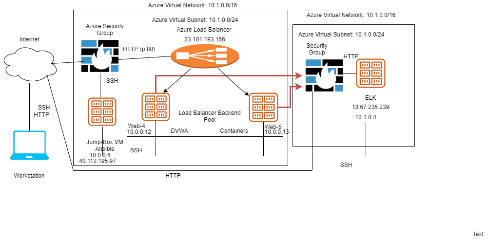
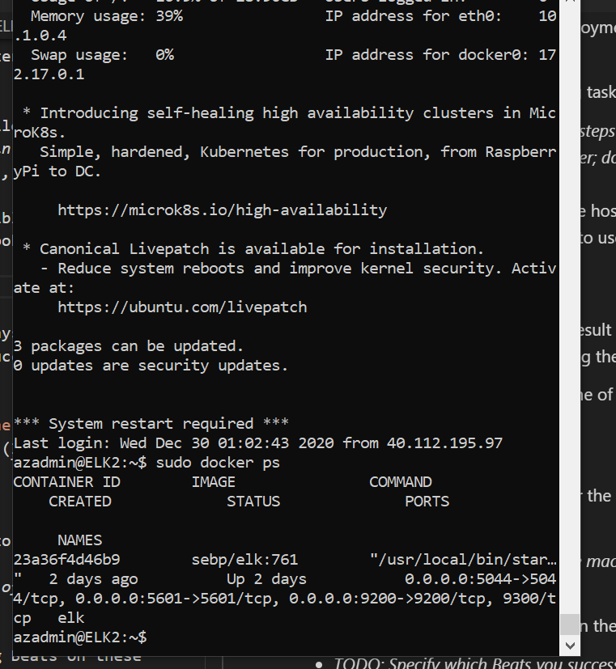

## Automated ELK Stack Deployment

The files in this repository were used to configure the network depicted below.

These files have been tested and used to generate a live ELK deployment on Azure. They can be used to either recreate the entire deployment pictured above. Alternatively, select portions of the ansible file may be used to install only certain pieces of it, such as Filebeat.

  
![install ELK] (images/install-elk.yml)
This document contains the following details:
- Description of the Topologu
- Access Policies
- ELK Configuration
  - Beats in Use
  - Machines Being Monitored
- How to Use the Ansible Build

### Description of the Topology

The main purpose of this network is to expose a load-balanced and monitored instance of DVWA, the D*mn Vulnerable Web Application.

Load balancing ensures that the application will be highly available, in addition to restricting traffic to the network.
-Redirect traffic so the server doesnt go down. To host ansible and get the yml files on the server. 

Integrating an ELK server allows users to easily monitor the vulnerable VMs for changes to the network and system files.
- Filebeat watches for file modifications or suspicious files is it executable.
- Metricbeat will give you the metrics of the computers preferments.

The configuration details of each machine may be found below.
_Note: Use the [Markdown Table Generator](http://www.tablesgenerator.com/markdown_tables) to add/remove values from the table_.

| Name     | Function | IP Address | Operating System |
|----------|----------|------------|------------------|
| Jump Box | Gateway  | 10.0.0.1   | Linux            |
| Web5     |   DVWA     | 10.0.0.13  | Linux        |                  |
| Web4     |  DVWA        |  10.0.0.12 | Linux          |                  |
| ELK2     |  Logging Data   | 10.1.0.4 | Linux        |                  |

### Access Policies

The machines on the internal network are not exposed to the public Internet. 

Only the jump box machine can accept connections from the Internet. Access to this machine is only allowed from the following IP addresses:
- I added my public IP.

Machines within the network can only be accessed by the load balancer.
- _TODO: Which machine did you allow to access your ELK VM? I allowed Web4 and Web5 which is DVWA. What was its IP address? 10.0.0.12 and 10.0.0.13

A summary of the access policies in place can be found in the table below.

| Name     | Publicly Accessible | Allowed IP Addresses |
|----------|---------------------|----------------------|
| Jump Box | Yes        | My public IP   |
| Web4         | No       | 10.0.0.12 |
|    Web5           | No    | 10.0.0.13 |
|   ELK2       | Yes   | 10.1.0.4|

### Elk Configuration

Ansible was used to automate configuration of the ELK machine. No configuration was performed manually, which is advantageous because...
-  Less risk of errors and faster deployment with automation. 

The playbook implements the following tasks:
- _TODO: In 3-5 bullets, explain the steps of the ELK installation play. E.g., install Docker; download image; etc._
- . Add your new VM to the Ansible hosts file.
- . Create a new Ansible playbook to use for your new ELK virtual machine. 
- . Increase the memory 

The following screenshot displays the result of running `docker ps` after successfully configuring the ELK instance.

### Target Machines & Beats
This ELK server is configured to monitor the following machines:
- 10.0.0.12
- 10.0.0.13

We have installed the following Beats on these machines:
- filebeat
- metricbeat

These Beats allow us to collect the following information from each machine:
- 'filebeat' monitors files changes, which we use to collect logs of apache.
- 'metricbeat' monitors metrics across the web server, which we use to check the status of the cpu/ram.

### Using the Playbook
In order to use the playbook, you will need to have an Ansible control node already configured. Assuming you have such a control node provisioned: 

SSH into the control node and follow the steps below:
- Copy the playbook file to ansible.
- Update the playbook file to include the user name.
- Run the playbook, and navigate to webserver/DVWA to check that the installation worked as expected.

- _Which file is the playbook? pentest.yml Where do you copy it?_ ansible folder
- _Which file do you update to make Ansible run the playbook on a specific machine? pentest.yml How do I specify which machine to install the ELK server on versus which to install Filebeat on?_ The private IPs
- _Which URL do you navigate to in order to check that the ELK server is running? http://[my.VM.IP]:5601/app/kibana

_As a **Bonus**, provide the specific commands the user will need to run to download the playbook, update the files, etc._
ansible-playbook install_elk.yml elk
ansible-playbook filebeat-playbook.yml webservers
ansible-playbook metricbeat.yml webservers

